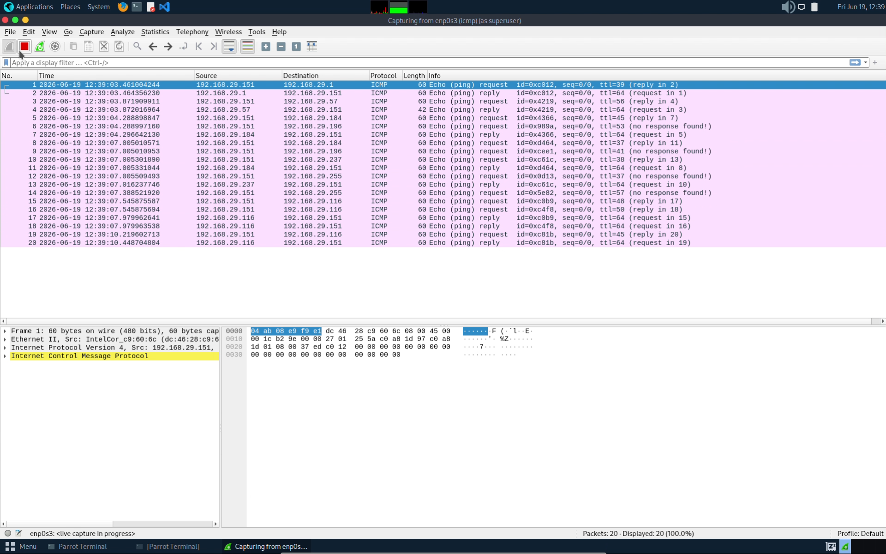
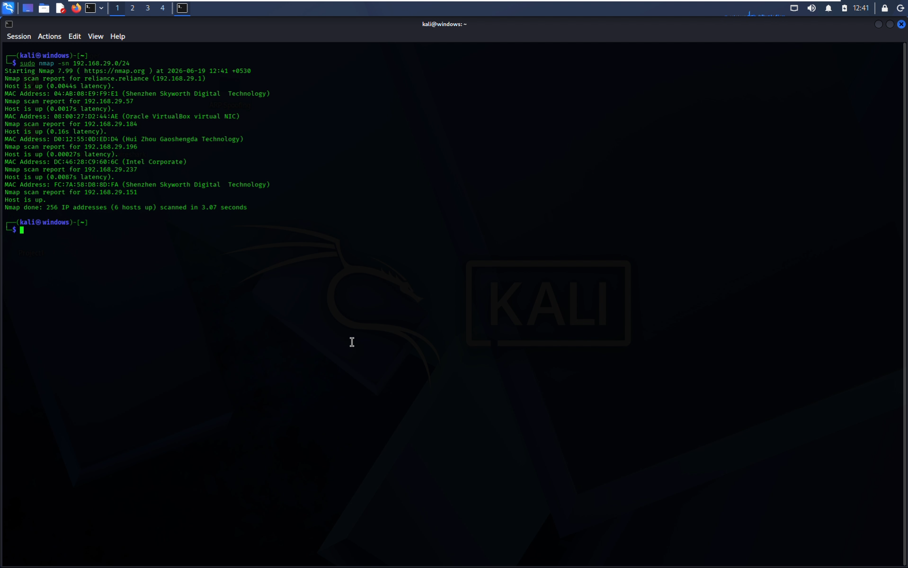
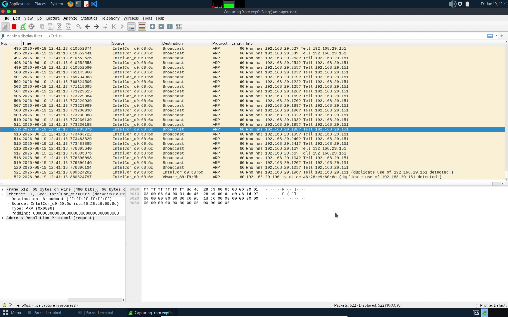
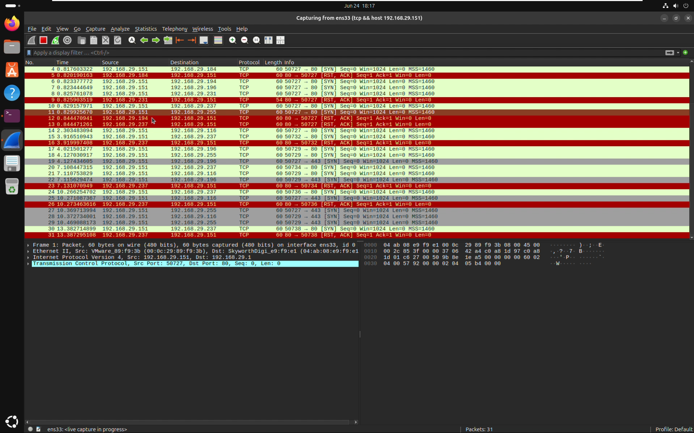
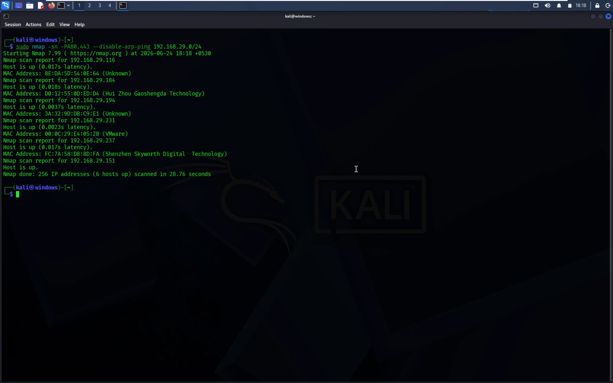
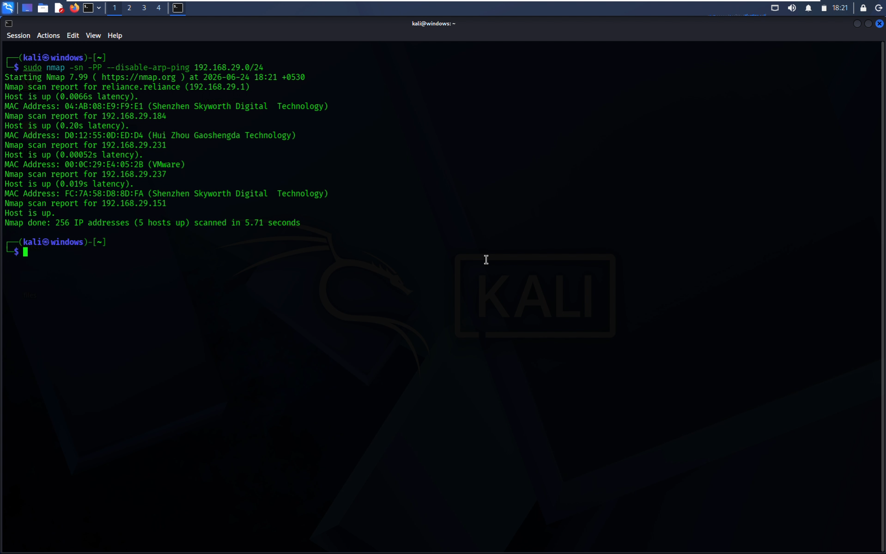
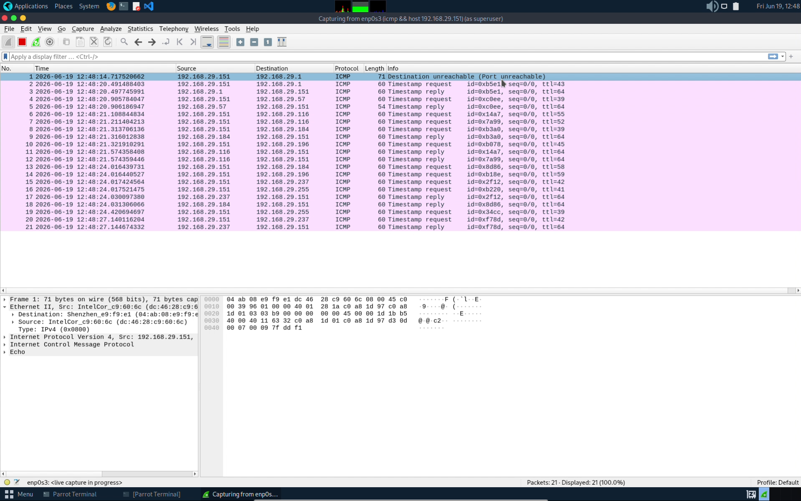
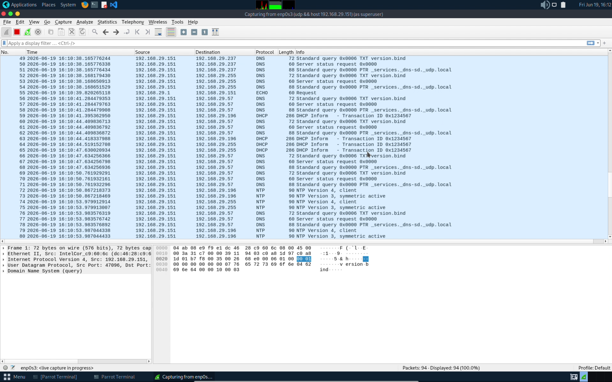

## 1. ICMP Echo Host Scan

### Objective

An ICMP (Internet Control Message Protocol) Echo host discovery scan, often called a ping sweep, is a network reconnaissance technique used to identify active IP addresses. It systematically sends ICMP Echo Request packets to a range of IP addresses and waits for Echo Reply responses to confirm that hosts are live and reachable.

### Attack Tool

**Nmap**

### Command Used

```bash id="tt1g0v"
sudo nmap -sn -PE --disable-arp-ping 192.168.29.0/24
```

### Command Explanation

| Option             | Description                                                                    |
| -------------------|--------------------------------------------------------------------------------|
| `sudo`             | Runs Nmap with administrative privileges, allowing it to send raw ICMP packets.|
| `-sn`              | Performs host discovery only (Ping Scan); skips port scanning.                 |
| `-PE`              | Uses ICMP Echo Requests (Ping) to discover active hosts.                       |
|`--disable-arp-ping`| --disable-arp-ping was used to prevent Nmap from performing ARP-based host discovery on the local network and force it to use the specified probe (such as ICMP Echo -PE) for host discovery instead.                           |           
| `192.168.29.0/24`  | Network range being scanned.                                                   |
### Working  
  
1. Nmap sends an ICMP Echo Request (Type 8) to each target IP.  
2. Active hosts respond with an ICMP Echo Reply (Type 0).  
3. Nmap marks responding hosts as Up.  
4. Hosts that do not respond may be offline or filtering ICMP traffic.

### Attack Execution Screenshot


### Wireshark Display Filter

```wireshark id="epx1h5"
icmp
```

### Filter Explanation

Displays ICMP packets generated during the scan, including:

- ICMP Echo Request
- ICMP Echo Reply

This filter helps isolate host discovery traffic from other network activity.

### Wireshark Analysis Screenshot



### Packet Capture

[Wireshark Pcap file](pcaps/icmp_echo_scan.pcap)

### Observations

* ICMP Echo Requests were sent from the Kali Linux attacker.
* Active hosts responded with ICMP Echo Replies.
* Source and destination IP addresses were successfully identified.
* Round-trip communication was observed.

### Security Significance

ICMP ping scanning is commonly used during the reconnaissance phase to discover live hosts before further enumeration.

### Report

[Report](reports/icmp_echo_scan_report.md)


## 2. ARP Host Scan

### Objective

An ARP (Address Resolution Protocol) host discovery scan is a network reconnaissance technique used to identify active devices on a local network. It works by sending ARP Requests to target IP addresses and listening for ARP Replies, which reveal the IP and MAC addresses of active hosts.

### Attack Tool

**Nmap**

### Command Used

```bash
sudo nmap -sn 192.168.29.0/24
```

### Command Explanation

| Option            | Description                                                               |
| ----------------- | ------------------------------------------------------------------------- |
| `sudo`            | Runs Nmap with administrative privileges, allowing direct network access. |
| `-sn`             | Performs host discovery only (Ping Scan); skips port scanning.            |
| `192.168.29.0/24` | Network range being scanned.                                              |

### Working

1. Nmap sends ARP Requests to hosts within the target subnet.
2. Active devices respond with ARP Replies containing their MAC addresses.
3. Nmap identifies responding hosts as Up.
4. The discovered IP and MAC addresses are displayed in the scan results.

### Attack Execution Screenshot



### Wireshark Display Filter

```wireshark
arp
```

### Filter Explanation

Displays ARP packets generated during the scan, including:

* ARP Request
* ARP Reply

This filter helps isolate ARP-based host discovery traffic from other network activity.

### Wireshark Analysis Screenshot



### Packet Capture

[Wireshark Pcap file](pcaps/arp_scan.pcap)

### Observations

* ARP Requests were broadcast across the local network.
* Active devices responded with ARP Replies.
* IP-to-MAC address mappings were successfully identified.
* Layer 2 communication between devices was observed.

### Security Significance

ARP scanning is commonly used during the reconnaissance phase to enumerate devices on a local network and map IP addresses to MAC addresses before conducting further assessment activities.

### Report

[Report](reports/arp_scan_report.md)


## 3. TCP SYN Host Scan

### Objective

A TCP SYN host discovery scan is a reconnaissance technique used to identify active hosts by sending TCP SYN packets to specific ports and monitoring the responses. Hosts that respond with SYN-ACK or RST packets are considered active and reachable on the network.

### Attack Tool

**Nmap**

### Command Used

```bash
sudo nmap -sn -PS80,443 --disable-arp-ping 192.168.29.0/24
```

### Command Explanation

| Option             | Description                                                                 |
| ------------------ | --------------------------------------------------------------------------- |
| `sudo`             | Runs Nmap with administrative privileges, allowing raw packet transmission. |
| `-sn`              | Performs host discovery only; skips port scanning.                          |
| `-PS80,443`        | Sends TCP SYN probes to ports 80 (HTTP) and 443 (HTTPS).                    |
|`--disable-arp-ping`| --disable-arp-ping was used to prevent Nmap from performing ARP-based host discovery on the local network and force it to use the specified probe (such as TCP SYN -PS80,443) for host discovery instead.                    |
| `192.168.29.0/24`  | Network range being scanned.                                                |

### Working

1. Nmap sends TCP SYN packets to ports 80 and 443 on each target host.
2. Active hosts respond with either:
   * **SYN-ACK** if the port is open.
   * **RST** if the port is closed.
3. Any valid response indicates that the host is reachable.
4. Nmap marks responding systems as Up.

### Attack Execution Screenshot


### Wireshark Display Filter

```wireshark
tcp.flags.syn == 1
```

### Filter Explanation

Displays TCP packets containing the SYN flag, including:

* TCP SYN Requests
* TCP SYN-ACK Responses

This filter helps isolate TCP-based host discovery traffic from other network activity.

### Wireshark Analysis Screenshot



### Packet Capture

[Wireshark Pcap file](pcaps/tcp_syn_scan.pcap)

### Observations

* TCP SYN packets were sent to ports 80 and 443 on target hosts.
* Active hosts responded with SYN-ACK or RST packets.
* Reachable systems were successfully identified.
* TCP handshake-related traffic was clearly visible in Wireshark.

### Security Significance

TCP SYN host discovery is commonly used when ICMP traffic is filtered or blocked. It allows attackers and administrators to identify active hosts by leveraging responses from commonly used TCP service ports.

### Report

[Report](reports/tcp_syn_scan_report.md)


## 4. TCP ACK Host Scan

### Objective

A TCP ACK host discovery scan is a reconnaissance technique used to identify active hosts by sending TCP ACK packets to specific ports and analyzing the responses. Hosts that respond with TCP RST packets are considered active and reachable on the network.

### Attack Tool

**Nmap**

### Command Used

```bash
sudo nmap -sn -PA80,443 --disable-arp-ping 192.168.29.0/24
```

### Command Explanation

| Option             | Description                                                                 |
| ------------------ | --------------------------------------------------------------------------- |
| `sudo`             | Runs Nmap with administrative privileges, allowing raw packet transmission. |
| `-sn`              | Performs host discovery only; skips port scanning.                          |
| `-PA80,443`        | Sends TCP ACK probes to ports 80 (HTTP) and 443 (HTTPS).                    |
|`--disable-arp-ping`| --disable-arp-ping was used to prevent Nmap from performing ARP-based host discovery on the local network and force it to use the specified probe (such as TCP ACK -PA80,443) for host discovery instead.                    |
| `192.168.29.0/24`  | Network range being scanned.                                                |

### Working

1. Nmap sends TCP ACK packets to ports 80 and 443 on each target host.
2. Active hosts respond with TCP RST packets because no existing connection is associated with the ACK packet.
3. The response indicates that the host is reachable.
4. Nmap marks responding hosts as Up.

### Attack Execution Screenshot



### Wireshark Display Filter

```wireshark
tcp.flags.ack == 1
```

### Filter Explanation

Displays TCP packets containing the ACK flag, including:

* TCP ACK Requests
* TCP RST Responses

This filter helps isolate TCP ACK host discovery traffic from other network activity.

### Wireshark Analysis Screenshot


### Packet Capture

[Wireshark Pcap file](pcaps/tcp_ack_host_scan.pcap)

### Observations

* TCP ACK packets were sent to ports 80 and 443 on target hosts.
* Active hosts responded with TCP RST packets.
* Reachable systems were successfully identified.
* TCP-based host discovery traffic was clearly visible in Wireshark.

### Security Significance

TCP ACK host discovery is useful when ICMP traffic is filtered or blocked. By leveraging TCP responses from commonly accessible ports, it helps identify active hosts while potentially bypassing some network filtering mechanisms.

### Report

[Report](reports/tcp_ack_scan_report.md)


## 5. ICMP Timestamp Host Scan

### Objective

An ICMP Timestamp host discovery scan is a reconnaissance technique used to identify active hosts by sending ICMP Timestamp Request packets and analyzing the Timestamp Reply responses. Hosts that respond are considered active and reachable on the network.

### Attack Tool

**Nmap**

### Command Used

```bash id="icmpts"
sudo nmap -sn -PP --disable-arp-ping 192.168.29.0/24
```

### Command Explanation

| Option             | Description                                                                      |
| -------------------| -------------------------------------------------------------------------------- |
| `sudo`             | Runs Nmap with administrative privileges, allowing raw ICMP packet transmission. |
| `-sn`              | Performs host discovery only; skips port scanning.                               |
| `-PP`              | Uses ICMP Timestamp Requests for host discovery.                                 |
|`--disable-arp-ping`| --disable-arp-ping was used to prevent Nmap from performing ARP-based host discovery on the local network and force it to use the specified probe (such as ICMP Timestamp -PP) for host discovery instead.                        |
| `192.168.29.0/24`  | Network range being scanned.                                                     |

### Working

1. Nmap sends ICMP Timestamp Request packets to each target IP address.
2. Active hosts respond with ICMP Timestamp Reply packets.
3. Nmap analyzes the replies and marks responding hosts as Up.
4. The replies contain timestamp information from the target system.

### Attack Execution Screenshot



### Wireshark Display Filter

```wireshark
icmp
```

### Filter Explanation

Displays ICMP packets generated during the scan, including:

* ICMP Timestamp Request (Type 13)
* ICMP Timestamp Reply (Type 14)

This filter helps isolate ICMP Timestamp discovery traffic from other network activity.

### Wireshark Analysis Screenshot



### Packet Capture

[Wireshark Pcap file](pcaps/icmp_timestamp_scan.pcap)

### Observations

* ICMP Timestamp Request packets were sent to hosts within the target network.
* Active hosts responded with ICMP Timestamp Reply packets.
* Reachable systems were successfully identified.
* Timestamp values from responding hosts were visible in the packet capture.

### Security Significance

ICMP Timestamp scanning can be used to identify active hosts when traditional ICMP Echo Requests are filtered. Additionally, timestamp responses may reveal system clock information that could be useful during reconnaissance.

### Report

[Report](reports/icmp_timestamp_scan_report.md)


## 6. UDP Host Scan

### Objective

A UDP host discovery is a reconnaissance technique used to identify active hosts by sending UDP packets to specific ports and analyzing the responses. Hosts that respond with UDP replies or ICMP Port Unreachable messages are considered active and reachable on the network.

### Attack Tool

**Nmap**

### Command Used

```bash id="udpdisc"
sudo nmap -sn -PU53,67,123 --disable-arp-ping 192.168.29.0/24
```

### Command Explanation

| Option             | Description                                                                 |
| -------------------| --------------------------------------------------------------------------- |
| `sudo`             | Runs Nmap with administrative privileges, allowing raw packet transmission. |
| `-sn`              | Performs host discovery only; skips port scanning.                          |
| `-PU53,67,123`     | Sends UDP probes to ports 53 (DNS), 67 (DHCP), and 123 (NTP).               |
|`--disable-arp-ping`| --disable-arp-ping was used to prevent Nmap from performing ARP-based host discovery on the local network and force it to use the specified probe (such as UDP -PU53,,67,123) for host discovery instead.                    |
| `192.168.29.0/24`  | Network range being scanned.                                                |

### Working

1. Nmap sends UDP packets to ports 53, 67, and 123 on each target host.
2. Active hosts may respond with UDP packets if the service is available.
3. If the ports are closed, hosts often return ICMP Port Unreachable messages.
4. Any valid response indicates that the host is reachable.
5. Nmap marks responding hosts as Up.

### Attack Execution Screenshot


### Wireshark Display Filter

```wireshark
udp || icmp
```

### Filter Explanation

Displays packets generated during the scan, including:

* UDP Probe Packets
* UDP Responses
* ICMP Destination Unreachable (Port Unreachable) Messages

This filter helps isolate UDP-based host discovery traffic from other network activity.

### Wireshark Analysis Screenshot



### Packet Capture

[Wireshark Pcap file](pcaps/udp_host_scan.pcap)

### Observations

* UDP probes were sent to ports 53, 67, and 123 on target hosts.
* Some hosts responded with UDP packets from active services.
* Closed ports generated ICMP Port Unreachable messages.
* Reachable systems were successfully identified through UDP-based discovery.

### Security Significance

UDP host discovery is useful when ICMP traffic is filtered or blocked. It leverages responses from common UDP services to identify active hosts and can reveal the presence of DNS, DHCP, and NTP services on the network.

### Report

[Report](reports/udp_host_scan_report.md)
