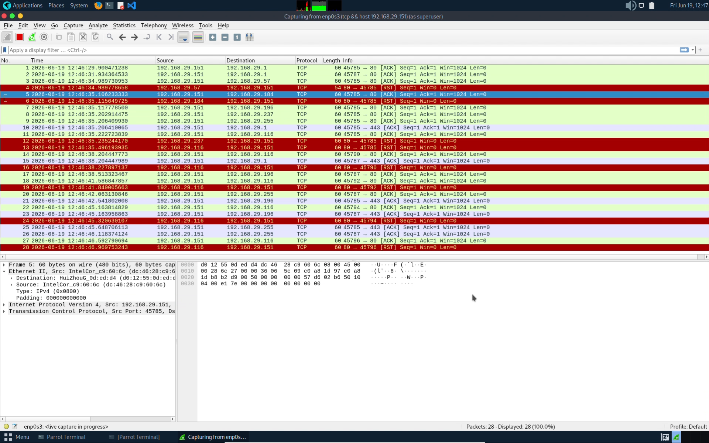

## 1. TCP Connect Scan

### Objective

A TCP Connect Scan is a reconnaissance technique used to identify open TCP ports on a target host by completing the full TCP three-way handshake. It helps determine which services are accessible on the target system.

### Attack Tool

**Nmap**

### Command Used

```bash
sudo nmap -sT <target-ip>
```

### Command Explanation

| Option        | Description                                                        |
| ------------- | ------------------------------------------------------------------ |
| `sudo`        | Runs Nmap with administrative privileges.                          |
| `-sT`         | Performs a TCP Connect Scan by completing the full TCP connection. |
| `<target-ip>` | IP address of the target host being scanned.                       |

### Working

1. Nmap sends a TCP SYN packet to the target port.
2. If the port is open, the target responds with a SYN-ACK packet.
3. Nmap sends an ACK packet to complete the TCP three-way handshake.
4. The connection is immediately terminated using a TCP RST packet.
5. If the port is closed, the target responds with a TCP RST packet.

### Attack Execution Screenshot


### Wireshark Display Filter

```wireshark
tcp
```

### Filter Explanation

Displays TCP packets generated during the scan, including:

* TCP SYN
* TCP SYN-ACK
* TCP ACK
* TCP RST

This filter helps isolate TCP connection establishment traffic from other network activity.

### Wireshark Analysis Screenshot


### Packet Capture

[Wireshark Pcap file](pcaps/tcp_connect_scan.pcap)

### Observations

* TCP SYN packets were sent to target ports.
* Open ports responded with SYN-ACK packets.
* Nmap completed the TCP three-way handshake.
* Connections were terminated immediately after establishment.
* Closed ports responded with TCP RST packets.

### Security Significance

TCP Connect Scans are commonly used during reconnaissance to identify open ports and running services. Because the complete TCP connection is established, these scans are more likely to be logged and detected by security monitoring systems.

### Report

[Report](reports/tcp_connect_scan_report.md)


## 2. TCP SYN (Stealth) Scan

### Objective

A TCP SYN Scan, also known as a Stealth Scan, is a reconnaissance technique used to identify open TCP ports on a target host without completing the full TCP three-way handshake. It is one of the most commonly used port scanning methods due to its speed and relatively low visibility.

### Attack Tool

**Nmap**

### Command Used

```bash
sudo nmap -sS <target-ip>
```

### Command Explanation

| Option        | Description                                                                 |
| ------------- | --------------------------------------------------------------------------- |
| `sudo`        | Runs Nmap with administrative privileges, allowing raw packet transmission. |
| `-sS`         | Performs a TCP SYN (Stealth) Scan.                                          |
| `<target-ip>` | IP address of the target host being scanned.                                |

### Working

1. Nmap sends a TCP SYN packet to the target port.
2. If the port is open, the target responds with a SYN-ACK packet.
3. Nmap immediately sends a TCP RST packet instead of completing the connection.
4. If the port is closed, the target responds with a TCP RST packet.
5. Nmap determines the port state based on the received responses.

### Attack Execution Screenshot


### Wireshark Display Filter

```wireshark
tcp.flags.syn == 1 || tcp.flags.reset == 1
```

### Filter Explanation

Displays TCP packets generated during the scan, including:

* TCP SYN
* TCP SYN-ACK
* TCP RST

This filter helps isolate TCP SYN scanning traffic and observe how Nmap identifies open and closed ports without completing the TCP handshake.

### Wireshark Analysis Screenshot


### Packet Capture

[Wireshark Pcap file](pcaps/tcp_stealth_scan.pcap)

### Observations

* TCP SYN packets were sent to target ports.
* Open ports responded with SYN-ACK packets.
* Nmap terminated connections using TCP RST packets.
* Closed ports responded with TCP RST packets.
* No full TCP connections were established.

### Security Significance

TCP SYN Scans are widely used during reconnaissance because they efficiently identify open ports while generating less connection logging than TCP Connect Scans. Network defenders often monitor for unusual SYN traffic patterns to detect scanning activity.

### Report

[Report](reports/tcp_syn_scan_report.md)


## 3. UDP Scan

### Objective

A UDP Scan is a reconnaissance technique used to identify open UDP ports and discover UDP-based services running on a target host. Since UDP is connectionless, determining port states relies on analyzing service responses and ICMP error messages.

### Attack Tool

**Nmap**

### Command Used

```bash id="udpportscan"
sudo nmap -sU <target-ip>
```

### Command Explanation

| Option        | Description                                                                 |
| ------------- | --------------------------------------------------------------------------- |
| `sudo`        | Runs Nmap with administrative privileges, allowing raw packet transmission. |
| `-sU`         | Performs a UDP port scan.                                                   |
| `<target-ip>` | IP address of the target host being scanned.                                |

### Working

1. Nmap sends UDP packets to target ports.
2. If a UDP service is running, the target may respond with a UDP packet.
3. If a port is closed, the target typically responds with an ICMP Port Unreachable message.
4. If no response is received, the port may be open, filtered, or silently dropping packets.
5. Nmap determines the port state based on the received responses.

### Attack Execution Screenshot


### Wireshark Display Filter

```wireshark id="udpfilter"
udp || icmp
```

### Filter Explanation

Displays packets generated during the scan, including:

* UDP Probe Packets
* UDP Service Responses
* ICMP Destination Unreachable (Port Unreachable) Messages

This filter helps isolate UDP scanning traffic and analyze port responses.

### Wireshark Analysis Screenshot


### Packet Capture

[Wireshark Pcap file](pcaps/udp_scan.pcap)

### Observations

* UDP probe packets were sent to target ports.
* Open UDP services responded with UDP packets.
* Closed ports generated ICMP Port Unreachable messages.
* Some ports returned no response and were marked as open|filtered.
* UDP service availability was successfully analyzed.

### Security Significance

UDP Scans are commonly used during reconnaissance to identify exposed UDP services such as DNS, DHCP, NTP, SNMP, and TFTP. Because UDP is connectionless and often less monitored than TCP, attackers may use UDP scanning to discover services that could be targeted in later stages of an assessment.

### Report

[Report](reports/udp_scan_report.md)


## 4. TCP ACK Scan

### Objective

A TCP ACK Scan is a reconnaissance technique used to determine whether ports are filtered or unfiltered by a firewall. Unlike other port scans, it does not identify open ports directly but helps map firewall rules and packet filtering behavior.

### Attack Tool

**Nmap**

### Command Used

```bash id="tcpackscan"
sudo nmap -sA <target-ip>
```

### Command Explanation

| Option        | Description                                                                 |
| ------------- | --------------------------------------------------------------------------- |
| `sudo`        | Runs Nmap with administrative privileges, allowing raw packet transmission. |
| `-sA`         | Performs a TCP ACK Scan.                                                    |
| `<target-ip>` | IP address of the target host being scanned.                                |

### Working

1. Nmap sends TCP ACK packets to target ports.
2. If the port is unfiltered, the target responds with a TCP RST packet.
3. If no response or an ICMP error message is received, the port is considered filtered.
4. Nmap uses the responses to identify firewall filtering rules.
5. The scan helps distinguish between filtered and unfiltered ports.

### Attack Execution Screenshot


### Wireshark Display Filter

```wireshark id="tcpackfilter"
tcp.flags.ack == 1 || tcp.flags.reset == 1
```

### Filter Explanation

Displays packets generated during the scan, including:

* TCP ACK Packets
* TCP RST Responses

This filter helps isolate TCP ACK scanning traffic and observe firewall behavior.

### Wireshark Analysis Screenshot



### Packet Capture

[Wireshark Pcap file](pcaps/tcp_ack_scan.pcap)

### Observations

* TCP ACK packets were sent to target ports.
* Unfiltered ports responded with TCP RST packets.
* Filtered ports generated no response or ICMP error messages.
* Firewall filtering behavior was successfully identified.
* Port accessibility was analyzed without establishing connections.

### Security Significance

TCP ACK Scans are commonly used to map firewall rules and determine whether packet filtering mechanisms are present. They can help attackers and defenders understand how a firewall handles unsolicited TCP traffic.

### Report

[Report](reports/tcp_ack_scan_report.md)


## 5. TCP FIN Scan

### Objective

A TCP FIN Scan is a stealth reconnaissance technique used to identify open TCP ports by sending TCP packets with only the FIN flag set. It relies on RFC-compliant TCP behavior, where closed ports respond with a RST packet while open ports typically ignore the probe.

### Attack Tool

**Nmap**

### Command Used

```bash id="tcpfinscan"
sudo nmap -sF <target-ip>
```

### Command Explanation

| Option        | Description                                                                 |
| ------------- | --------------------------------------------------------------------------- |
| `sudo`        | Runs Nmap with administrative privileges, allowing raw packet transmission. |
| `-sF`         | Performs a TCP FIN Scan.                                                    |
| `<target-ip>` | IP address of the target host being scanned.                                |

### Working

1. Nmap sends TCP packets with only the FIN flag set to target ports.
2. Closed ports respond with a TCP RST packet.
3. Open ports typically ignore the FIN packet and do not respond.
4. Nmap analyzes the responses to determine the port state.
5. Ports that do not respond are marked as open|filtered.

### Attack Execution Screenshot


### Wireshark Display Filter

```wireshark id="tcpfinfilter"
tcp.flags.fin == 1 || tcp.flags.reset == 1
```

### Filter Explanation

Displays packets generated during the scan, including:

* TCP FIN Packets
* TCP RST Responses

This filter helps isolate TCP FIN scanning traffic and analyze target responses.

### Wireshark Analysis Screenshot


### Packet Capture

[Wireshark Pcap file](pcaps/tcp_fin_scan.pcap)

### Observations

* TCP FIN packets were sent to target ports.
* Closed ports responded with TCP RST packets.
* Open ports generally produced no response.
* Port states were inferred from the presence or absence of responses.
* Stealth scanning behavior was visible in the packet capture.

### Security Significance

TCP FIN Scans are often used to evade simple packet filtering mechanisms and reduce logging compared to traditional TCP Connect Scans. Network defenders may monitor unusual FIN packet activity as an indicator of reconnaissance attempts.

### Report

[Report](reports/tcp_fin_scan_report.md)


## 6. TCP NULL Scan

### Objective

A TCP NULL Scan is a stealth reconnaissance technique used to identify open TCP ports by sending TCP packets with no flags set. It relies on RFC-compliant TCP behavior, where closed ports respond with a RST packet while open ports typically ignore the probe.

### Attack Tool

**Nmap**

### Command Used

```bash id="tcpnullscan"
sudo nmap -sN <target-ip>
```

### Command Explanation

| Option        | Description                                                                 |
| ------------- | --------------------------------------------------------------------------- |
| `sudo`        | Runs Nmap with administrative privileges, allowing raw packet transmission. |
| `-sN`         | Performs a TCP NULL Scan.                                                   |
| `<target-ip>` | IP address of the target host being scanned.                                |

### Working

1. Nmap sends TCP packets with no flags set to target ports.
2. Closed ports respond with a TCP RST packet.
3. Open ports typically ignore the packet and do not respond.
4. Nmap analyzes the responses to determine the port state.
5. Ports that do not respond are marked as open|filtered.

### Attack Execution Screenshot


### Wireshark Display Filter

```wireshark id="tcpnullfilter"
tcp.flags == 0x000 || tcp.flags.reset == 1
```

### Filter Explanation

Displays packets generated during the scan, including:

* TCP NULL Packets (No Flags Set)
* TCP RST Responses

This filter helps isolate TCP NULL scanning traffic and analyze target responses.

### Wireshark Analysis Screenshot


### Packet Capture

[Wireshark Pcap file](pcaps/tcp_null_scan.pcap)

### Observations

* TCP packets with no flags set were sent to target ports.
* Closed ports responded with TCP RST packets.
* Open ports generally produced no response.
* Port states were inferred from the presence or absence of responses.
* Stealth scanning behavior was visible in the packet capture.

### Security Significance

TCP NULL Scans are often used to evade simple firewall rules and intrusion detection systems that focus on standard TCP connection attempts. Monitoring unusual TCP packets with no flags set can help identify reconnaissance activity on a network.

### Report

[Report](reports/tcp_null_scan_report.md)


## 7. TCP XMAS Scan

### Objective

A TCP XMAS Scan is a stealth reconnaissance technique used to identify open TCP ports by sending TCP packets with the FIN, PSH, and URG flags set. The packet is called an "XMAS" packet because multiple flags are lit up like a Christmas tree. It relies on RFC-compliant TCP behavior, where closed ports respond with a RST packet while open ports typically ignore the probe.

### Attack Tool

**Nmap**

### Command Used

```bash id="tcpxmasscan"
sudo nmap -sX <target-ip>
```

### Command Explanation

| Option        | Description                                                                 |
| ------------- | --------------------------------------------------------------------------- |
| `sudo`        | Runs Nmap with administrative privileges, allowing raw packet transmission. |
| `-sX`         | Performs a TCP XMAS Scan.                                                   |
| `<target-ip>` | IP address of the target host being scanned.                                |

### Working

1. Nmap sends TCP packets with the FIN, PSH, and URG flags set.
2. Closed ports respond with a TCP RST packet.
3. Open ports typically ignore the packet and do not respond.
4. Nmap analyzes the responses to determine the port state.
5. Ports that do not respond are marked as open|filtered.

### Attack Execution Screenshot


### Wireshark Display Filter

```wireshark id="tcpxmasfilter"
tcp.flags.fin == 1 && tcp.flags.push == 1 && tcp.flags.urg == 1 || tcp.flags.reset == 1
```

### Filter Explanation

Displays packets generated during the scan, including:

* TCP XMAS Packets (FIN, PSH, URG Set)
* TCP RST Responses

This filter helps isolate TCP XMAS scanning traffic and analyze target responses.

### Wireshark Analysis Screenshot


### Packet Capture

[Wireshark Pcap file](pcaps/tcp_xmas_scan.pcap)

### Observations

* TCP packets with FIN, PSH, and URG flags set were sent to target ports.
* Closed ports responded with TCP RST packets.
* Open ports generally produced no response.
* Port states were inferred from the presence or absence of responses.
* XMAS scan traffic was clearly visible in the packet capture.

### Security Significance

TCP XMAS Scans are used to evade basic packet filtering and identify open ports without performing a standard TCP connection. Unusual packets containing FIN, PSH, and URG flags can be indicators of reconnaissance activity and should be monitored by network defenders.

### Report

[Report](reports/tcp_xmas_scan_report.md)


<!--## 8. TCP Idle Scan

### Objective

A TCP Idle Scan is an advanced stealth reconnaissance technique used to identify open TCP ports on a target host by leveraging a third-party system known as a "zombie." This technique allows the attacker to scan the target indirectly, making it difficult to trace the scan back to the actual source.

### Attack Tool

**Nmap**

### Command Used

```bash id="tcpidlescan"
sudo nmap -sI <zombie-ip> <target-ip>
```

### Command Explanation

| Option        | Description                                                                 |
| ------------- | --------------------------------------------------------------------------- |
| `sudo`        | Runs Nmap with administrative privileges, allowing raw packet transmission. |
| `-sI`         | Performs a TCP Idle Scan using a zombie host.                               |
| `<zombie-ip>` | IP address of the idle host used to relay scan traffic.                     |
| `<target-ip>` | IP address of the target host being scanned.                                |

### Working

1. Nmap probes the zombie host to determine its IP ID sequence number.
2. Nmap sends spoofed TCP SYN packets to the target using the zombie's IP address as the source.
3. If the target port is open, the target responds to the zombie with a SYN-ACK packet.
4. The zombie responds with a RST packet, incrementing its IP ID value.
5. Nmap checks the zombie's IP ID again to determine whether the port is open or closed.

### Attack Execution Screenshot


### Wireshark Display Filter

```wireshark id="tcpidlefilter"
tcp.flags.syn == 1 || tcp.flags.reset == 1
```

### Filter Explanation

Displays packets generated during the scan, including:

* TCP SYN Packets
* TCP SYN-ACK Responses
* TCP RST Packets

This filter helps analyze the indirect communication between the zombie host and the target system.

### Wireshark Analysis Screenshot


### Packet Capture

[Wireshark Pcap file](pcaps/tcp_idle_scan.pcap)

### Observations

* Nmap utilized a zombie host to perform indirect scanning.
* TCP SYN packets were spoofed using the zombie's IP address.
* Open ports caused the zombie's IP ID value to increment.
* Port states were determined without directly contacting the target.
* The attack source remained hidden from the target system.

### Security Significance

TCP Idle Scans are highly stealthy because the target sees the zombie host as the source of the scan rather than the attacker. This technique can be used to bypass logging mechanisms and obscure the origin of reconnaissance activities, making it valuable for both attackers and penetration testers.

### Report

[Report](reports/tcp_idle_scan_report.md)-->
